# Lab1 - Shell

_Ryan George & Rishabh Rastogi - Sir Tuff and Mr Tuff_  
Our implementation of a simple shell parser, implementing and all the proposed extensions and tested.

## Development

Discussing together our methodology for this project, we decided that writing skeleton code together for each function then splitting off and implementing them independently was the best way for us. This meant we both worked on atleast half of each functionailty of the shell. In the skeleton code, we would define a simple function prototype and note what the function would take in and what it would return. Examples of this can be seen in our git commits:

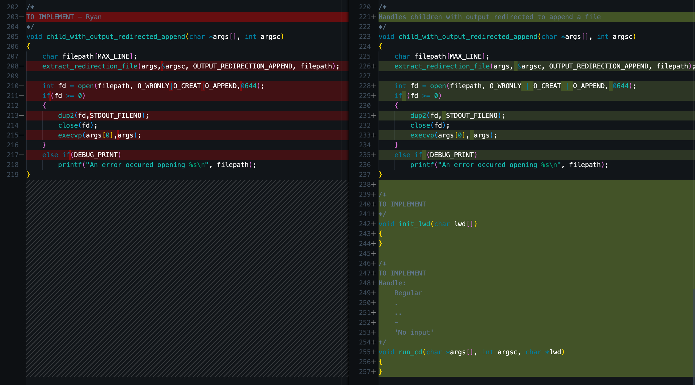
In the picture above you can see the completion of section 3. The skeleton code for child with output redirected to append was completed and then for the next section empty functions were added ready to be implemented.

This methodology allowed us to work in parralel with great efficiency. This is like an incremental methodology as we tested every section as a new prototype every time.

## Features

We implemented all the entire requirements and extensions of the assignment. We added several quality of life features to improve usability and debugging. This includes a debug mode that allows users to view detailed error messages, along with additional enhancements to make the shell easier to use and troubleshoot.

- Basic commands: Fully implemented, including prompt display, command parsing, and execution using `fork()` and `execvp()`. The shell correctly handles the `exit` command.

- Redirection: Fully implemented for input `<` and output `>/>>`, with correct extraction of file paths and use of `dup2()`. Single redirection per command is supported.

- `cd`: supports `cd <dir>`, `cd (home)`, and `cd `- (previous directory). The shell prompt updates dynamically to show the current working directory.

- Pipes: Fully implemented for pipelines of any length. Each stage correctly redirects stdin and stdout using `dup2()` and closes unused file descriptors.

- Batched: Fully implemented; multiple commands execute independently.

- Proposed Extensions (PE1 & PE2): Subshells and nested subshells are fully supported. Subshells run commands in a child process without affecting the main shell. Nested subshells are handled recursively.

- Extras: Debug print hooks for tracing, robust parentheses-aware semicolon parsing, and safeguards for subshells adjacent to pipes. The shell also tracks nested subshell depth, making it aware of how deeply commands are nested.

### Task 1 - Basic commands

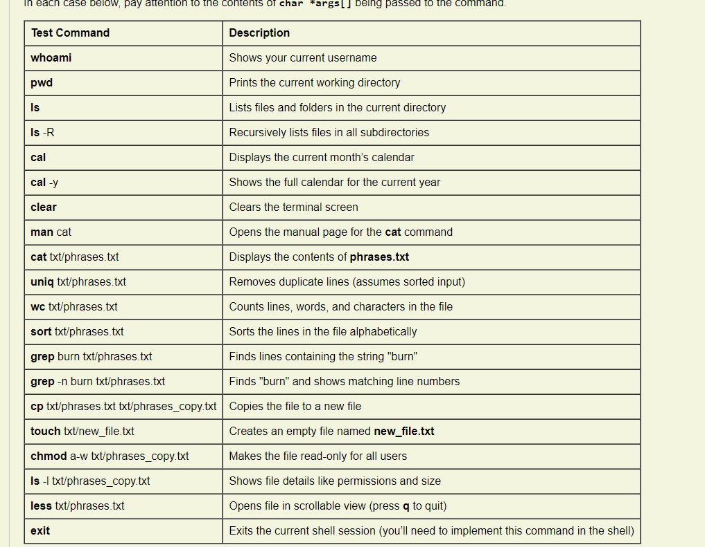

Testing given commands

→ `pwd`

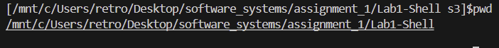

→ `ls -R`

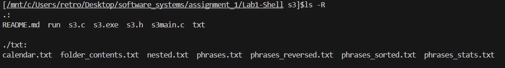

→ `sort txt/phrases.txt`

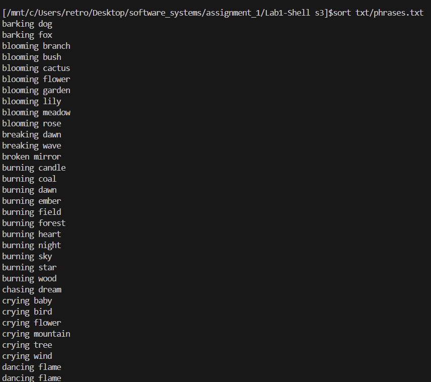

→ `grep -n burn txt/phrases.txt`

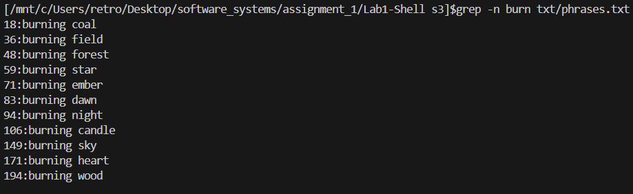

→ `cp txt/phrases.txt txt/phrases_copy.txt`

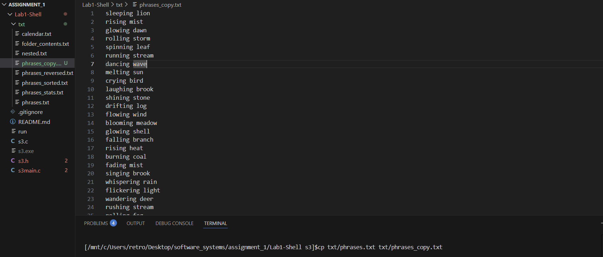

### Task 2 - Commands with redirection

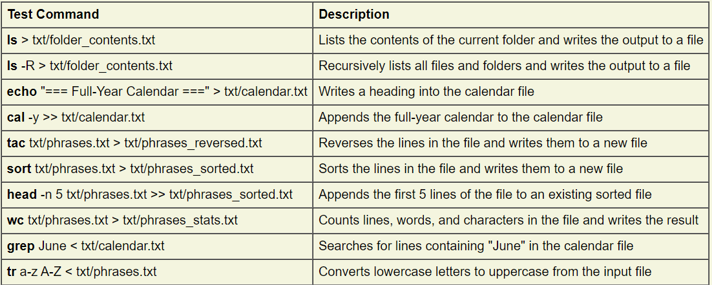

Testing given commands

→ `cal -y >> txt/calender.txt`

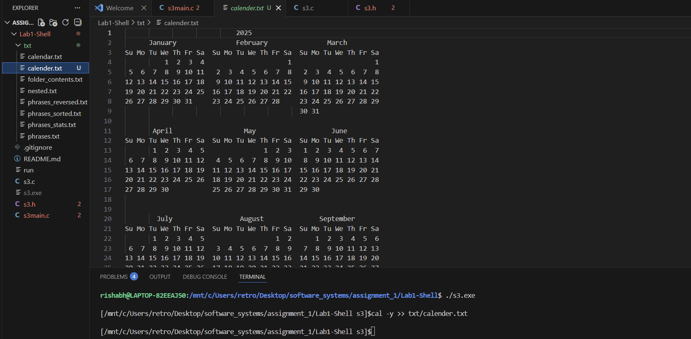

→ `wc txt/phrases.txt. > txt/phrases_stats.txt`

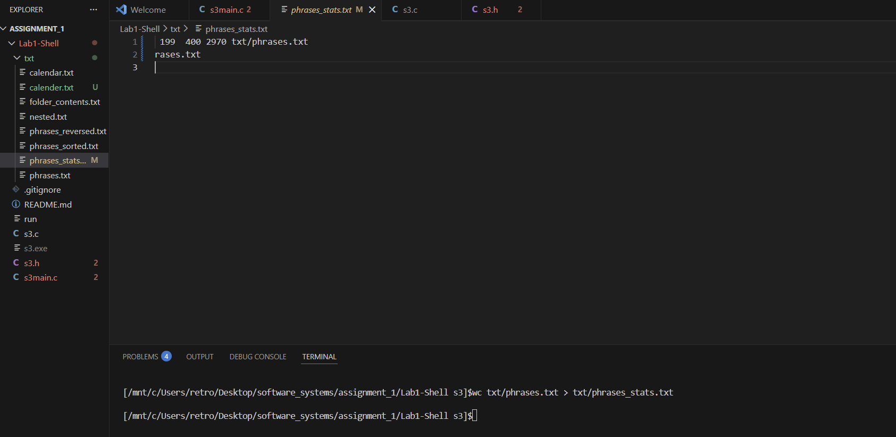

→ `tr a-z A-Z < txt/phrases.txt`

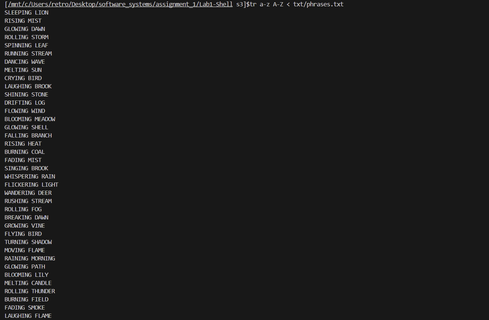

### Task 3 - Support for cd

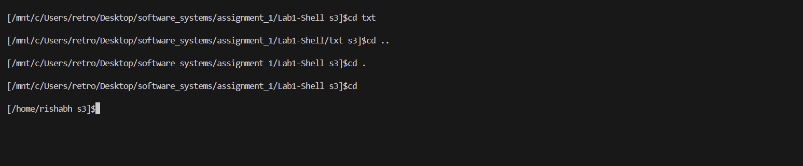

As we can see

→ `cd txt` takes it into the txt file  
→ `cd ..` takes it back to the previous directory  
→ `cd .` is able to stay in the cwd and refreshes it  
→ `cd ` followed by nothing takes it to the home directory

### Task 4 - Piped commands

→ `cat txt/phrases.txt | sort > txt/phrases_sorted.txt`

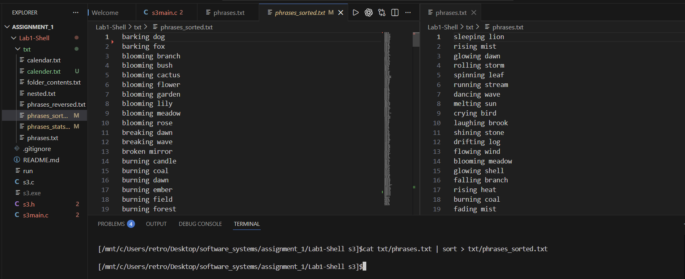

→ `tr a-z A-Z < txt/phrases.txt | grep BURN | sort | wc -l`

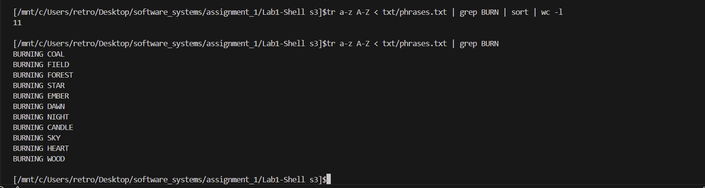

- There are 11, confirming that the function works as expected.

→ `ps aux | grep python | sort -k 3 -nr | head`

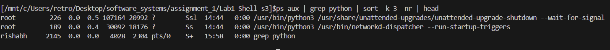

### Task 5 - Batched commands

→ `mkdir results ; cat txt/phrases.txt | sort | tac > results/rev_sort_phr.txt ; echo "Processing complete."`

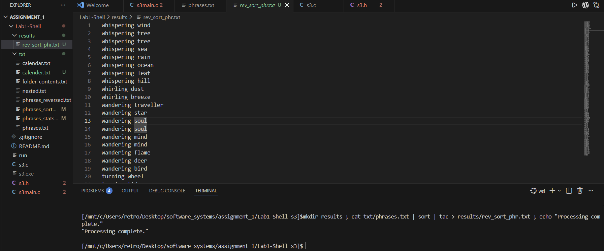

→ `echo "Start processing"; cat txt/phrases.txt | sort > txt/phrases_sorted.txt; head -n 5 txt/phrases.txt; echo "Processing complete"`

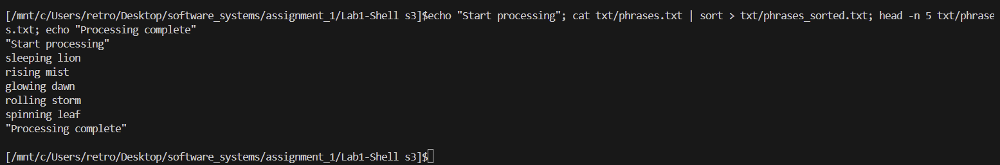

→ `sort txt/phrases.txt | uniq > txt/phrases_unique.txt; wc -l txt/phrases_unique.txt`

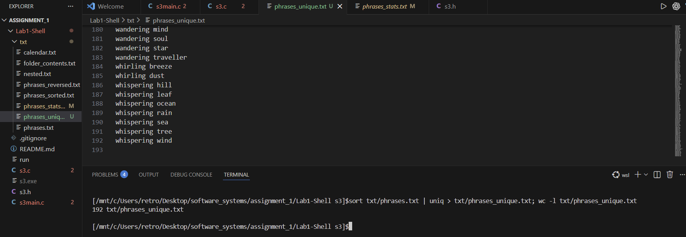

### Task 6 - Proposed Extension 1: Subshells

→ `echo "Batch start"; (grep -i burn txt/phrases.txt | sort > txt/phrases_burn_sorted.txt); wc -l txt/phrases_burn_sorted.txt; echo "Batch complete"`

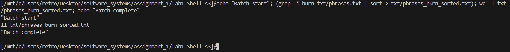

→ `echo "Starting"; (head -n 5 txt/phrases.txt | sort > txt/phrases_top5_sorted.txt); cat txt/phrases_top5_sorted.txt; echo "Finished"`

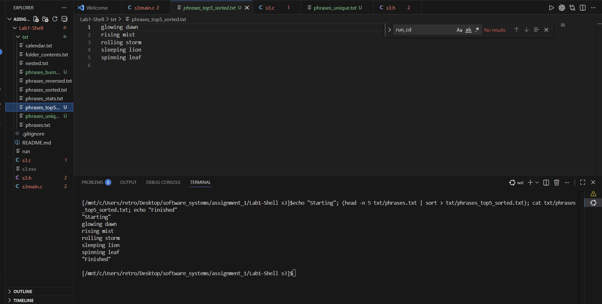

### Task 7 - Proposed Extension 2: Nested Subshells

→ `echo "Start"; (echo "Outer subshell"; (head -n 3 txt/phrases.txt | sort > txt/top3_sorted.txt); cat txt/top3_sorted.txt); echo "Done"`

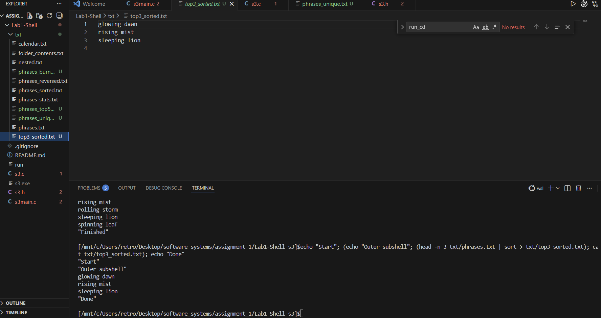

→ `echo "Start"; (cat txt/phrases.txt | head -n 5 > txt/outer_top5.txt; echo "Outer layer"; (sort txt/outer_top5.txt | uniq > txt/middle_unique.txt; echo "Middle layer"; (grep -i burn txt/middle_unique.txt | wc -l > txt/inner_burn_count.txt; echo "Inner layer"))); echo "Done"`

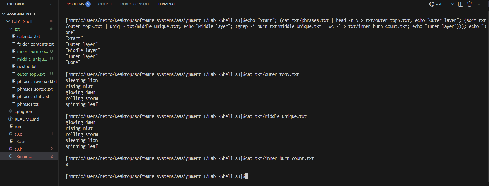

- 0 as expected as there are no "burn"s in the file
